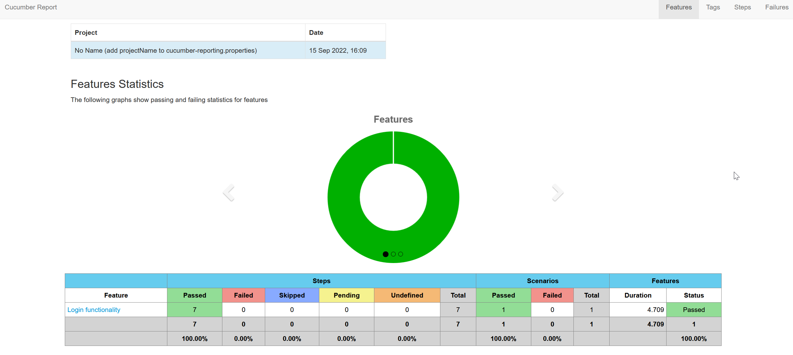

Developed in Java with Rest Assured

### Execution API Tests
`cd C:\Users\Digriz\IdeaProjects\Slotegrator` - setup your way to project

`mvn clean test` - to run from command line. Also you may run them inside the IDE.

During the execution all request/recieve logs will be in the terminal window.

### Execution UI Tests

`mvn clean test` - to run from command line. Also you may run them inside the IDE.

#### src/test folder:

`Folder: objects` - object Player class;

`Folder: resources -> features` - contains feature of Cucumber for create UI tests;

`SlotegratorAPITests.java` - Api Test file;

`Folder: runner` - include Main Runner for UI;

`Folder: steps` - include common steps for UI testing

`Folder: pages` - has all pages and their data

`Requests.java` - helper for authentication, generate requests, set base urls, etc.

#### src/main/resources folder:

Schemas of JSON response for comparing during tests:
* `createNewUserResponseJSONSchema.json` - create new player, `POST /players/` request
* `getUserResponseJSONSchema.json` - get info about player, `GET /players/{userId}` request 
* `chromedriver.exe` - driver for run UI tests

### Generated reports:
* `https://reports.cucumber.io/report-collections/260ea374-4da2-4147-a230-048e20e22b55` - Online report
* 
* `/target/cucumber-html-report` - Default Cucumber report
* `/target/screenshots` -  In case of failed tests, screenshots will be there

)
